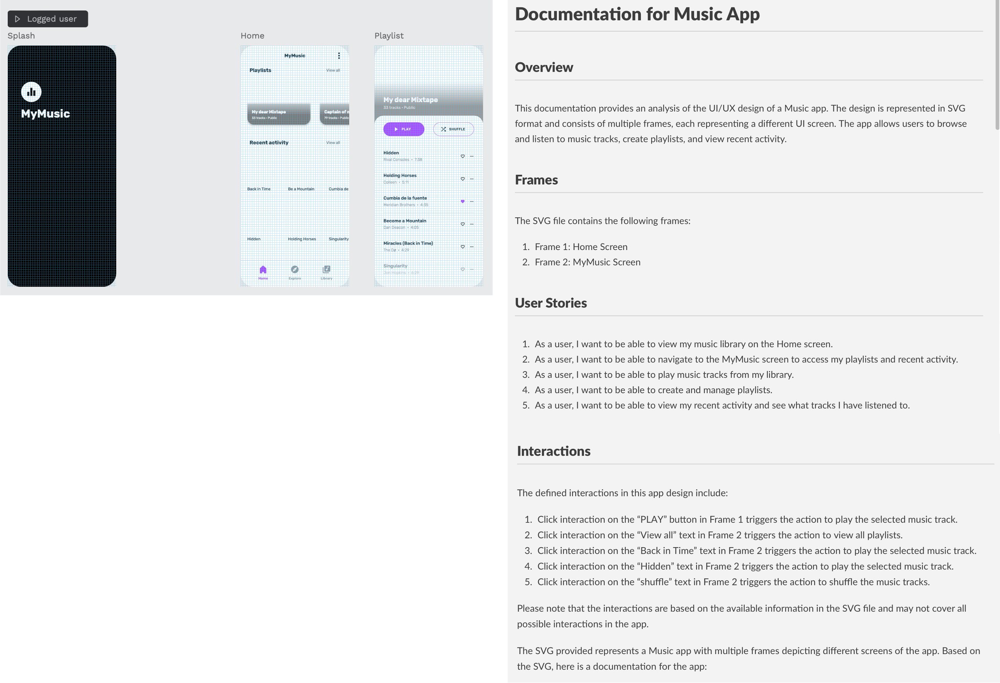
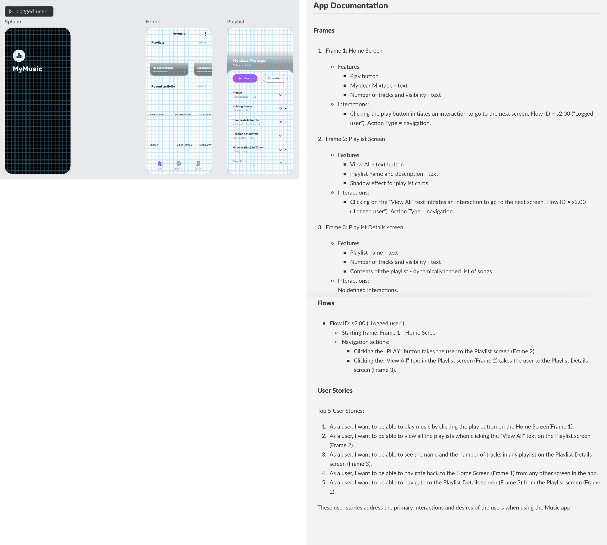

# Approach #1 | Documentation generation from “cleaned” SVG**

| Technology readiness | Risks | Complexity |
| ----- | ----- | ---------- |
| 🟢 Ready for implementation | <div style="width: 100pt"> 🟡 Moderate risk | <div style="width: 150pt"> 🟡 Moderately complex |


## Proposed pipeline

Such a process will be 2-stage and can look like this. 
    
- Parse and clean the SVG file
    - remove images
    - remove unused tags:  `x` , `y`, `width`, `etc`
    - if possible, replace elements with comment placeholders: `<!-- Color picker -→`
- Run info extraction with LLM using several prompts
    
    Prompt #1
    ```
    Please, generate the documentation for this app and user stories. Generate top-5 user stories. Describe the defined interactions in this app design. Structure your answer with markdown.
    ```
    Prompt #2
    ```
    Please, generate the documentation for this app and user stories. Precisecly describe the flow in the app. You should pay attention to the flow, interaction and attributes like `event-type` and `action-type` to be able to describe interactions inside the app. Structure your answer with markdown.
    ```

##  🖼️ Demo

**gpt3-16k | Try #1**



**gpt3-16k | Try #2**



## Relevant works

There is no particular existing paper/module/FIgma plugin that re-creates such functionality, however, some works can be highly relevant. 
    
[How it works](https://www.documatic.com/how-it-works)

## Pros and Cons

🟢 Pros
    
- Automating the process speeds up the overall development lifecycle
- The possible use of AI models with unlimited context windows allows for a deeper understanding of the SVG design, leading to more accurate and detailed documentation.
- This idea has a sufficiently ready technological background for real-world implementation.

🔴 Cons

- SVG files can be quite complex, with numerous tags and properties. Parsing and cleaning these files, especially removing images and replacing elements with comment placeholders, might not always be straightforward or consistent across different designs.
- Risk of losing the nuanced understanding or intent of the designer, which may not be completely captured in the SVG file
